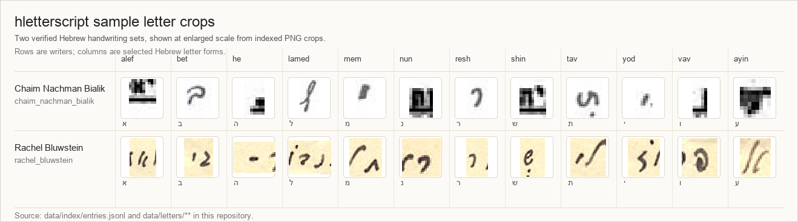
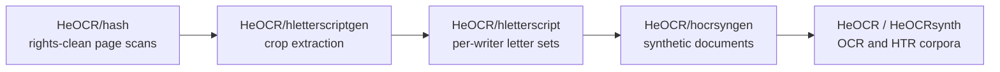

# hletterscript

[](https://github.com/HeOCR/hletterscript/actions/workflows/ci.yml)


Created by [Shay Palachy Affek](http://www.shaypalachy.com/).

Per-writer sets of cropped handwritten Hebrew letter images, extracted
from rights-clean page scans for synthetic handwriting generation and
OCR/HTR research.



## At a Glance

| Field | Value |
| --- | --- |
| Corpus shape | Writer-grouped Hebrew letter crops |
| Current seed corpus | 48 crops from 2 verified writers |
| Covered letter forms | 25 Hebrew letter-form slugs |
| Current writers | Chaim Nachman Bialik, Rachel Bluwstein |
| Canonical crop index | [`data/index/entries.jsonl`](data/index/entries.jsonl) |
| Canonical writer index | [`data/index/writers.jsonl`](data/index/writers.jsonl) |
| Image storage | [`data/letters/<writer_id>/<letter_name>/`](data/letters/) via Git LFS |
| Metadata license | CC0 1.0 |
| Per-image rights | Inherited per crop from the upstream scan |

## What This Repository Contains

`hletterscript` is a data repository for individual Hebrew letter crops,
grouped by the person who wrote them. Each entry links the crop back to
the source scan, bounding box, extraction method, file checksum, quality
flags, and inherited rights statement.

The corpus is intentionally small and strict at this stage: it is a
validated seed dataset for the surrounding HeOCR tooling, not yet a
complete Hebrew handwriting corpus.

## Pipeline Position



Related projects:

- [HeOCR/hash][upstream] is the page-scan source of truth.
- [HeOCR/hletterscriptgen][gen] produces the letter crops.
- [HeOCR/hocrsyngen][syngen] consumes this repository for synthetic
  document generation.
- [HeOCR/HeOCRsynth][heocrsynth] and [HeOCR/HeOCR][heocr] are intended
  downstream OCR/HTR targets.

[upstream]: https://github.com/HeOCR/hash
[gen]: https://github.com/HeOCR/hletterscriptgen
[syngen]: https://github.com/HeOCR/hocrsyngen
[heocrsynth]: https://github.com/HeOCR/HeOCRsynth
[heocr]: https://github.com/HeOCR/HeOCR

## Dataset Layout

- [`docs/dataset_structure.md`](docs/dataset_structure.md) defines the
  repository layout, index model, rights inheritance, and ingestion flow.
- [`docs/letters.md`](docs/letters.md) is the canonical Hebrew-letter
  enumeration: 27 forms, covering the 22 base letters plus 5 finals.
- [`data/index/writers.jsonl`](data/index/writers.jsonl) is the set-level
  catalog: one JSON object per writer or scribe.
- [`data/index/entries.jsonl`](data/index/entries.jsonl) is the crop-level
  catalog: one JSON object per image, with upstream provenance,
  extraction provenance, file checksums, quality flags, and inherited
  rights.
- [`data/letters/`](data/letters/) stores the crop image bytes.
- [`schemas/writer.schema.json`](schemas/writer.schema.json) and
  [`schemas/entry.schema.json`](schemas/entry.schema.json) define the
  record contracts.
- [`scripts/validate_indexes.py`](scripts/validate_indexes.py) validates
  JSONL records, referential integrity, Hebrew-letter consistency,
  upstream URLs, image checksums, and file sizes.
- [`scripts/generate_release_artifacts.py`](scripts/generate_release_artifacts.py)
  regenerates [`NOTICE.md`](NOTICE.md), [`CITATION.cff`](CITATION.cff),
  and [`datapackage.json`](datapackage.json) deterministically from the
  indexes.

## Licensing Model

This repository uses a compound licensing model:

- Repository-authored metadata, schemas, scripts, docs, and generated
  metadata exports are dedicated to the public domain under CC0 1.0.
- Each crop carries its own inherited rights block from the upstream scan.
  Current seed crops are public-domain compatible, but consumers should
  read the per-entry rights metadata rather than assume a uniform image
  license.

See [`LICENSE`](LICENSE) for the repository metadata license and
[`LICENSE.md`](LICENSE.md) for the full per-image rights policy.

## Requirements

- Python 3.11 or newer. CI currently validates 3.11, 3.12, and 3.13.
- Git LFS for the image bytes under `data/letters/**`.

After cloning:

```bash
git lfs install
git lfs pull
python3 -m pip install -r requirements-dev.txt
```

## Validate Locally

```bash
python3 scripts/validate_indexes.py
python3 scripts/generate_release_artifacts.py --check
python3 -m pytest
```

For the full CI-style upstream cross-check, place a checkout of
[`HeOCR/hash`](https://github.com/HeOCR/hash) at `.upstream` and run:

```bash
python3 scripts/validate_indexes.py --upstream-path .upstream
```

## Current Status

`v0.0.0-rc` is a validated seed corpus with 48 indexed letter crops from
2 verified writers. The repository has schema validation, deterministic
release-artifact generation, CI, and licensing policy in place.

Future ingestion work expands writer coverage and fills missing Hebrew
letter forms through crops produced by [HeOCR/hletterscriptgen][gen] from
the upstream HASH scans.

## Contributing

Contributors adding or reviewing crop entries should start with
[`AGENTS.md`](AGENTS.md). It captures ingest rules, naming conventions,
rights constraints, and the pre-PR checklist for this data repository.

## Credits

Created by [Shay Palachy Affek ](http://www.shaypalachy.com/) [[GitHub](https://github.com/shaypal5)]
